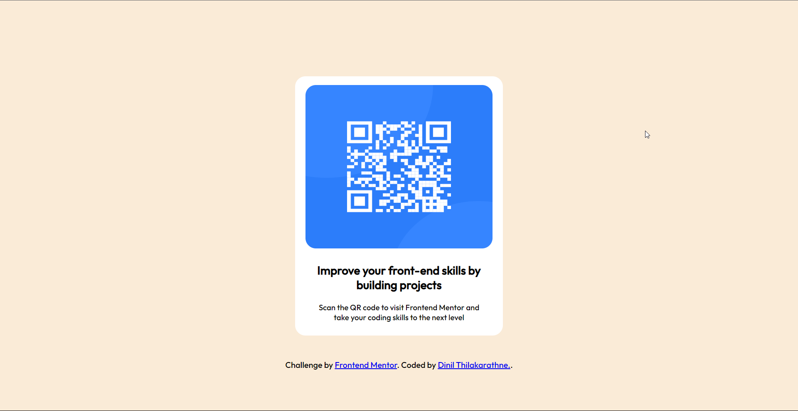

# Frontend Mentor - QR code component solution

This is a solution to the [QR code component challenge on Frontend Mentor](https://www.frontendmentor.io/challenges/qr-code-component-iux_sIO_H). Frontend Mentor challenges help you improve your coding skills by building realistic projects. 

## Table of contents

- [Overview](#overview)
  - [Screenshot](#screenshot)
  - [Links](#links)
- [My process](#my-process)
  - [Built with](#built-with)
  - [What I learned](#what-i-learned)
- [Author](#author)

**Note: Delete this note and update the table of contents based on what sections you keep.**

## Overview

### Screenshot

## Mobile View

## Desktop View 

### Links

- Solution URL: [Add solution URL here](https://your-solution-url.com)
- Live Site URL: [Add live site URL here](https://your-live-site-url.com)

## My process

### Built with

- Semantic HTML5 markup
- CSS custom properties
- Flexbox

### What I learned

* CSS Box Model 
* CSS FlexBox

## Author

- Website - [Dinil Thilakarathne]()
- Frontend Mentor - [@Dinil-Thilakarathne](https://www.frontendmentor.io/profile/Dinil-Thilakarathne)
- GitHub - [@Dinil-Thilakarathne](https://github.com/Dinil-Thilakarathne)

