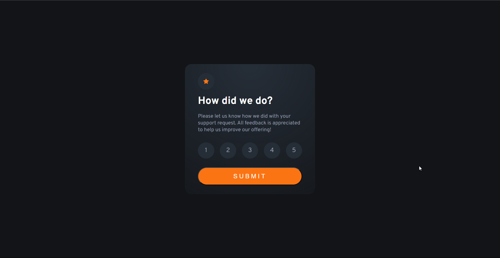
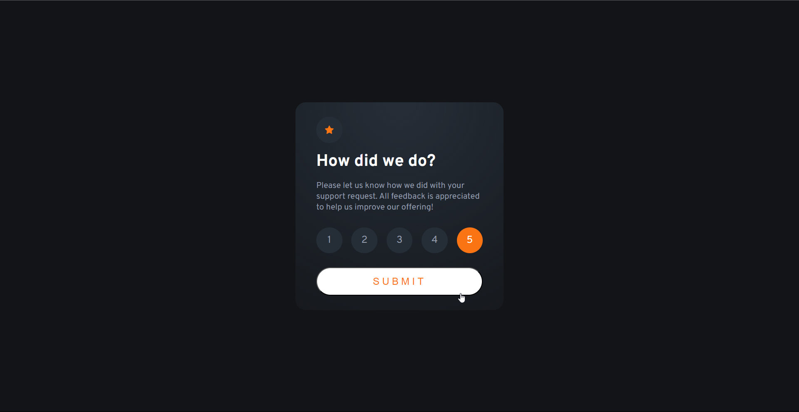
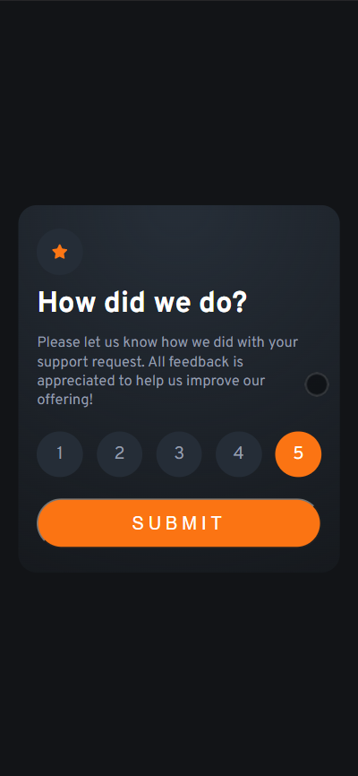

# Frontend Mentor - Interactive rating component solution

This is a solution to the [Interactive rating component challenge on Frontend Mentor](https://www.frontendmentor.io/challenges/interactive-rating-component-koxpeBUmI). Frontend Mentor challenges help you improve your coding skills by building realistic projects. 

## Table of contents

- [Overview](#overview)
  - [The challenge](#the-challenge)
  - [Screenshot](#screenshot)
  - [Links](#links)
- [My process](#my-process)
  - [Built with](#built-with)
  - [What I learned](#what-i-learned)
  - [Useful resources](#useful-resources)
- [Author](#author)


## Overview

### The challenge

Users should be able to:

- View the optimal layout for the app depending on their device's screen size
- See hover states for all interactive elements on the page
- Select and submit a number rating
- See the "Thank you" card state after submitting a rating

### Screenshot

## Desktop view
### Main design

### Hover & Button click effect

### Feedback card 


## Mobile view
### Main design

### Feedback card 


### Links

- Solution URL: [Add solution URL here](https://your-solution-url.com)
- Live Site URL: [Add live site URL here](https://your-live-site-url.com)

## My process

### Built with

- Semantic HTML5 markup
- CSS custom properties
- Flexbox
- CSS Grid
- Mobile-first workflow
- CSS Media quarries 
- JS for condition 

### What I learned

Toggle elements class using JS 


```js
for (let i = 0; i < ratingBtns.length; i++) {
  ratingBtns[i].addEventListener('click', function() {
    for (let j = 0; j < ratingBtns.length; j++) {
      ratingBtns[j].classList.remove('active');
    }
    this.classList.add('active');
  });
}
```


### Useful resources

### CSS Flexbox:

[CSS-Tricks](https://css-tricks.com/snippets/css/a-guide-to-flexbox/)
[W3Schools](https://www.w3schools.com/css/css3_flexbox.asp)

### Media Queries:

- [CSS-Tricks](https://css-tricks.com/a-complete-guide-to-css-media-queries/)
- [W3Schools](https://www.w3schools.com/css/css3_mediaqueries.asp)

## Author

- Frontend Mentor - [@Dinil-Thilakarathne](https://www.frontendmentor.io/profile/Dinil-Thilakarathne)
- Instagram - [Dinil Thilakarathne](https://www.instagram.com/sona_code/)
- GitHub - [@Dinil-Thilakarathne](https://github.com/Dinil-Thilakarathne)
- Youtube - [@sonacode](https://www.youtube.com/@sonacode)


